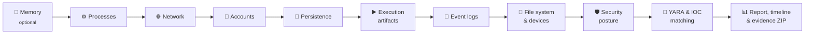

<div align="center">

# 🕵️ Windows Detective

### Live-response forensic triage & compromise assessment for Windows

**Powered by Bashar Salmo**

[](#-quick-start)
[](#-quick-start)
[](#-what-it-investigates)
[](#-forensic-notes)
[](LICENSE)

*A laptop may have been hacked. One command answers the question.*

[Quick start](#-quick-start) •
[Coverage](#-what-it-investigates) •
[Output](#-output) •
[Threat intel](#-bring-your-own-threat-intel) •
[Forensic notes](#-forensic-notes)

</div>

---

## ✨ Highlights

| | |
|---|---|
| ⚡ **Zero install** | Pure PowerShell 5.1: runs from a USB stick on any Windows 10/11 or Server 2016+ host |
| 🔒 **Read-only** | Never deletes, kills, quarantines or "fixes" anything on the host |
| 🧠 **Verdict, not just data** | 56 command-line rules and 30+ persistence checks, scored into a clear verdict with a 0–100 risk score |
| 🗺️ **MITRE ATT&CK mapped** | Every finding links to the technique it indicates |
| 🧹 **Low noise** | Repeated events are grouped with a count, and your own known-good tools can be allowlisted |
| 🕒 **Unified timeline** | Logons, executions, file drops, service installs and Defender events on one UTC timeline |
| 📦 **Evidence-ready** | SHA-256 manifest, hashed ZIP archive and exported EVTX files for chain of custody |
| 🌐 **Works offline** | The report is a single self-contained HTML file (light & dark mode) |

---

## 🚀 Quick start

> [!TIP]
> Copy the folder to **external media** and write the output there too. Don't install anything on the suspect machine.

**Option 1: double-click**

Right-click **`Run-WindowsDetective.bat`** and choose **Run as administrator**. The report opens automatically when the run finishes, and every scan session is saved in the **`Reports`** folder next to the tool.

**Option 2: PowerShell**

```powershell
Set-ExecutionPolicy -Scope Process Bypass
.\WindowsDetective.ps1 -CaseId IR-2026-042 -Analyst "Jane Doe" -OutputPath E:\Reports -OpenReport
```

**Option 3: full incident collection** (memory first, deep checks, raw evidence)

```powershell
.\WindowsDetective.ps1 -MemoryDump -Deep -CollectRawArtifacts -LoadUserHives -Days 90 -OutputPath E:\Reports
```

<details>
<summary><b>⚙️ All parameters</b></summary>

| Parameter | Purpose |
|---|---|
| `-Days <n>` | Investigation window (default **30**) |
| `-CaseId`, `-Analyst` | Printed in the report for chain of custody |
| `-OutputPath` | Where scan sessions are saved (default: `Reports\` inside the tool folder; use external media for evidential work) |
| `-Quick` | Fast triage: fewer events, smaller file sweep |
| `-Deep` | Loaded-DLL scan, System32 change check, deeper file sweep, 4× more events |
| `-CollectRawArtifacts` | Copies registry hives, Amcache, SRUM, WMI repository, browser history, jump lists, Prefetch, Tasks, Defender MPLog and flagged files |
| `-MemoryDump` | Captures RAM first (needs `tools\winpmem*.exe`) |
| `-LoadUserHives` | Also analyses the registry of users who are not logged on |
| `-NoEvtx` / `-NoZip` | Skips the EVTX export or the ZIP archive |
| `-MaxEvents <n>` | Events read per query (default 5000) |
| `-IocPath` | Folder of IOC lists (default `iocs\`) |
| `-AllowlistPath` | Known-good rules (default `iocs\allowlist.txt`) |
| `-OpenReport` | Opens the HTML report when finished |

</details>

---

## 🔄 How it works



Collection follows the **order of volatility**: memory first, then processes and network, then everything else.

---

## 🔍 What it investigates

<details open>
<summary><b>⚙️ Processes</b></summary>

- SHA-256 hash and signature of every running image
- Masquerading, such as `svchost.exe` in the wrong folder or look-alike names (`scvhost.exe`, `lsasss.exe`)
- Wrong parents: Office or PDF readers, web servers, WMI or `services.exe` spawning shells
- Processes whose executable was deleted, and renamed well-known tools
- Loaded DLLs from user-writable paths (`-Deep`)
</details>

<details>
<summary><b>🌐 Network</b></summary>

- Connections and listening ports with the owning process
- LOLBins or scripts talking to the internet, common C2 ports and bind shells
- Inbound RDP from public IP addresses
- DNS cache: tunnels (ngrok, trycloudflare), paste sites and IP-lookup services
- `hosts` file tampering, **netsh portproxy** pivots, proxy and PAC settings
- Shares, SMB sessions, ARP, routes, Wi-Fi profiles, firewall profiles and rules, RDP configuration
</details>

<details>
<summary><b>🔁 Persistence: 30+ autostart locations</b></summary>

Run and RunOnce keys (machine and every user) • Startup folders • Services (ImagePath, ServiceDll, FailureCommand, unquoted paths) • Scheduled tasks, including **hidden Tarrask-style tasks** • WMI event subscriptions • IFEO and SilentProcessExit • Winlogon Shell, Userinit and Notify • AppInit and AppCert DLLs • LSA packages and password filters • Sticky-keys backdoors • Netsh helpers • Print monitors • Time providers • COM hijacking • Office Test key • Screensaver • PowerShell profiles • Active Setup • BootExecute • BITS jobs
</details>

<details>
<summary><b>▶️ Evidence of execution</b></summary>

Prefetch • BAM • ShimCache (parsed) • Amcache (parsed, with SHA1) • UserAssist (ROT13-decoded) • **RunMRU**, which catches ClickFix fake-CAPTCHA pastes • PSReadLine history • Recent documents
</details>

<details>
<summary><b>📜 Event logs</b></summary>

| Source | Detections |
|---|---|
| **Security** | RDP and public-IP logons, pass-the-hash style logons, NTLMv1, **brute force and password spraying, including a later successful logon**, new accounts and privileged-group changes, audit-policy and time changes, log clearing, service and task creation, admin-share access, process creation (4688) |
| **System** | Service installs (7045), including vulnerable or unsigned drivers • log clearing (104) • security services disabled |
| **PowerShell** | Script blocks (4104) run through all rules • engine-flagged suspicious blocks • v2 downgrade |
| **RDP** | Inbound (1149, 21–25) and outbound (1024) |
| **Defender** | Detections, failed remediations, exclusions added, protection disabled, tamper attempts |
| **Sysmon** | Process, network, remote thread, **LSASS access**, registry, DNS and process-tampering events |
| **Other** | Task Scheduler, BITS, WinRM, WMI-Activity 5861, firewall rule changes |
</details>

<details>
<summary><b>📁 File system & devices</b></summary>

- Executables, scripts, disk images, OneNote, CHM, XLL and LNK files dropped in user-writable locations
- Hash, signature and the **Mark-of-the-Web download URL** of each file
- Double extensions and right-to-left-override filename tricks, malicious shortcuts, ransom notes
- Shadow copies, USB history, sideloaded or high-permission browser extensions
</details>

<details>
<summary><b>🛡️ Security posture & defense evasion</b></summary>

Defender status, exclusions and detection history • Registered AV products • **BYOVD vulnerable drivers** and unsigned drivers • UAC • WDigest • LSA protection • RestrictedAdmin • LocalAccountTokenFilterPolicy • LM/NTLM settings • SMBv1 • Credential Guard • BitLocker • Secure Boot • PowerShell v2 • Plaintext credentials in history and unattend files
</details>

<details>
<summary><b>👤 Accounts & 🧰 attacker tooling</b></summary>

- Hidden and `$` accounts, enabled Guest or Administrator, privileged group members, new profiles, logged-on sessions
- **30+ remote-access / RMM tools** (AnyDesk, ScreenConnect, NetSupport, Atera, RustDesk, …)
- Offensive and dual-use tools (Mimikatz, Rubeus, AdFind, rclone, ngrok, Chisel, EDR killers, …) found in processes, installed software, Prefetch, BAM, Amcache and files
</details>

> [!NOTE]
> The tool recognises its own scripts, case folders and launcher by marker, so its own activity never shows up as a finding.

---

## 📊 Output

| Verdict | Trigger |
|---|---|
| 🔴 **COMPROMISED** | Any Critical finding |
| 🟠 **HIGHLY SUSPICIOUS** | 3 or more High findings |
| 🟠 **SUSPICIOUS** | Any High finding |
| 🟡 **NEEDS REVIEW** | 5 or more Medium findings |
| 🟢 **NO STRONG INDICATORS** | Anything else |

The report also generates recommended next steps from what was found: containment, credential resets, ransomware handling and so on.

Every scan session is saved in the tool's own **`Reports`** folder, and one line per session is added to `Reports\scan_history.csv` (time, host, verdict, risk score, finding counts, report path) so earlier scans are easy to find and compare. The `Reports` folder is git-ignored, so scan results never end up in the repository.

```text
Reports\
├── scan_history.csv               one line per scan session
├── WDCase_<HOST>_<timestamp>.zip  (+ .zip.sha256) archive of the session
└── WDCase_<HOST>_<timestamp>\
    ├── WindowsDetective_Report.html   interactive report: verdict, findings, ATT&CK, timeline, artifacts
    ├── findings.json / findings.csv   all findings with severity, evidence and MITRE ids
    ├── timeline.csv                   unified UTC timeline from every source
    ├── system_info.json               host profile
    ├── collection.log                 what ran, when, and any errors
    ├── manifest.sha256.csv            SHA-256 of every output file (chain of custody)
    ├── raw\                           every artifact as CSV, process tree, audit policy, observed indicators
    ├── evtx\                          exported event logs (Hayabusa / Chainsaw / EvtxECmd ready)
    ├── files\                         Amcache, PSReadLine histories, raw artifacts, flagged files as <sha256>.bin
    └── memory\                        RAM image (only with -MemoryDump, kept out of the ZIP)
```

---

## 🎯 Bring your own threat intel

| What | How |
|---|---|
| **IOCs** | One indicator per line in `iocs\hashes.txt`, `iocs\ips.txt` or `iocs\domains.txt`, with an optional `, description`. Harmless EICAR test hashes are included so you can check matching works. |
| **YARA** | Drop `yara64.exe` into `tools\` and your `.yar` files into `rules\`. Starter rules are included. |
| **Allowlist** | Known-good activity in `iocs\allowlist.txt` (`hash:`, `path:` or `text:` rules, optional `\| reason`). Matching findings stay in the report as **Info**, tagged *allowlisted* with their original severity, so nothing is silently hidden. Common browser updaters are allowlisted by default. |
| **Custom rules** | Add an entry to `commandRules` in `rules\detection-data.json` (`id`, `severity`, `mitre`, `title`, `pattern`). Tool, RMM and vulnerable-driver lists live in the same file. |

Optional binaries (`winpmem`, `yara64`) are covered in [tools/README.md](tools/README.md).

---

## 🧪 Testing

```powershell
.\tests\Invoke-WDSelfTest.ps1
```

The self-test checks that the rules compile, that common benign command lines don't raise alerts, that the helper functions behave, that every MITRE id has a name, and that the report renders. It runs on PowerShell 5.1 and 7 on any OS and doesn't touch the host.

---

## 🧾 Forensic notes

> [!IMPORTANT]
> - Run as **Administrator**. Without it the Security log, Amcache, hidden tasks and other users' data are unavailable, and the report warns you.
> - Write output to **external media** (`-OutputPath E:\Reports`) to avoid overwriting deleted data on the evidence disk.
> - Capture **memory first** (`-MemoryDump`) when fileless malware is suspected. Never reboot a suspect host before memory capture.

> [!WARNING]
> `-CollectRawArtifacts` copies the SAM and SECURITY hives, which contain credential material. Handle the case folder as sensitive evidence.

- Locked files (hives, Amcache, SRUM) are copied through Volume Shadow Copy (`esentutl /vss`).
- This is automated triage. Validate each High or Critical finding before acting on it.

---

## 🛠️ Troubleshooting

<details>
<summary><b>"This script contains malicious content and has been blocked by your antivirus software"</b></summary>

A detection tool has to know what attacks look like, so antivirus can mistake it for one.
Windows Detective keeps all attack patterns in `rules\detection-data.json` (a data file AMSI doesn't scan) rather than in the PowerShell code. If a module is still blocked, the tool now **stops with a clear message** instead of producing a misleading report.

- Make sure every file in `lib\` and `rules\` is present. Antivirus may have quarantined one, so re-download if needed.
- If your EDR still blocks it, add a temporary exclusion for the tool folder for the duration of the investigation (standard practice for IR tooling).
- When Defender's history contains a detection of the tool's own files, the report lists it as **Info (category "Tool")**, not as malware on the host.
</details>

---

<details>
<summary><b>🗂️ Project layout</b></summary>

```text
WindowsDetective.ps1        entry point / orchestration
Run-WindowsDetective.bat    double-click launcher (self-elevates)
lib/
├── WD.Core.ps1             context, findings, timeline, file/registry/event helpers
├── WD.Rules.ps1            rule engine, masquerading, parent/child checks, MITRE names
├── WD.System.ps1           host profile, patches, software, accounts
├── WD.Processes.ps1        live process analysis
├── WD.Network.ps1          connections, DNS, hosts, proxy, portproxy, firewall, RDP
├── WD.Persistence.ps1      30+ autostart locations
├── WD.Execution.ps1        Prefetch, BAM, ShimCache, Amcache, UserAssist, RunMRU, PSReadLine
├── WD.EventLogs.ps1        Security / System / PowerShell / RDP / Defender / Sysmon analysis
├── WD.FileSystem.ps1       file sweep, MOTW, ransom notes, USB, browser extensions
├── WD.Security.ps1         Defender, drivers (BYOVD), hardening controls
├── WD.Evidence.ps1         IOC matching, YARA, memory, EVTX export, raw artifacts, manifest
└── WD.Report.ps1           HTML / JSON / CSV reporting
rules/
├── detection-data.json     command-line rules, offensive tools, RMM tools, vulnerable drivers
└── *.yar                   YARA rules
iocs/  tools/  tests/
```

</details>

---

<div align="center">

**🕵️ Windows Detective**: Powered by **Bashar Salmo**

Released under the [MIT License](LICENSE)

</div>
